 

## 💬 Kenalan Singkat

## 👋 Tentang Saya

Saya **Wahyu Prihanto, S.Kom**, guru **Teknik Komputer dan Jaringan (TKJ)** di **SMK Diponegoro Tumpang, Malang**. Saya memadukan pekerjaan lapangan (jaringan, MikroTik, Linux server) dengan pengembangan aplikasi, supaya kebutuhan sekolah sehari-hari bisa dilayani sistem yang andal.

- 🏫 Mengajar TKJ dan menjabat Koordinator Tatib
- 🌐 Setting MikroTik, VLAN, dan jaringan sekolah
- 💻 Sole developer **SIMPATI** dan **PPDB Online** (sistem live di sekolah)
- 📚 Membuat modul ajar dan alat bantu guru berbasis web

## 🔴 Sistem Live

| Sistem | Deskripsi | Link |
| --- | --- | --- |
| **SIMPATI** | Sistem informasi manajemen peserta didik: PWA, biometrik WebAuthn, 6 level akses | [Buka](https://simpatismkdiponegorotumpang.id/auth/login) |
| **PPDB Online** | Portal pendaftaran peserta didik baru, multi-step form dan slip registrasi | [Buka](https://ppdb.simpatismkdiponegorotumpang.id/index.php) |

## 🛠️ Tech Stack

## 🚀 Repositori Pilihan

| Repo | Deskripsi | Demo |
| --- | --- | --- |
| [**pak-damar**](https://github.com/Prihantowahyu/pak-damar) | Panduan interaktif bagi siswa SMK membuat aplikasi web pertama | [Live](https://prihantowahyu.github.io/pak-damar) |
| [**Pemeliharaan_Komputer**](https://github.com/Prihantowahyu/Pemeliharaan_Komputer) | Modul ajar kelas XI: perawatan dan pemeliharaan komputer | [Live](https://prihantowahyu.github.io/Pemeliharaan_Komputer) |
| [**kalkulatorakademik**](https://github.com/Prihantowahyu/kalkulatorakademik) | Kalkulator nilai, rata-rata, dan ketuntasan belajar | [Live](https://prihantowahyu.github.io/kalkulatorakademik) |
| [**ketuntasan**](https://github.com/Prihantowahyu/ketuntasan) | Pelaporan ketuntasan belajar siswa | [Live](https://prihantowahyu.github.io/ketuntasan) |
| [**pauddantk**](https://github.com/Prihantowahyu/pauddantk) | Website informasi dan pembelajaran PAUD & TK | [Live](https://prihantowahyu.github.io/pauddantk) |
| [**Myporto**](https://github.com/Prihantowahyu/Myporto) | Kode sumber portofolio ini | [Live](https://prihantowahyu.github.io/Myporto) |

## 📊 Statistik GitHub

## 🤝 Mari Berkolaborasi

Butuh konsultasi jaringan MikroTik, sistem informasi sekolah, atau pelatihan TKJ? Silakan hubungi lewat [WhatsApp](https://wa.me/6287775600462) atau lihat [portofolio lengkap](https://prihantowahyu.github.io/Myporto/).

